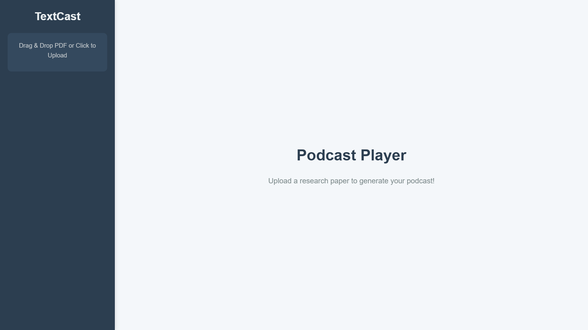

# TextCast

TextCast is an innovative web application that converts research papers (PDFs) into engaging audio podcasts and allows users to interactively ask questions about the content using a microphone. Built with Flask, it leverages AI technologies like Whisper for speech-to-text, Groq for natural language processing, and FAISS for retrieval-augmented generation (RAG) to provide a seamless experience.

## Screenshots

- **Main Interface**:
  

- **Recording a Question**:
  

- **Playing a Response**:
  

## Features

- **PDF to Podcast**: Upload a research paper PDF and generate a 5-6 minute podcast featuring a conversational dialogue between two AI hosts, Sophia and Mia.
- **Interactive Mode**: Pause the podcast, ask a question via microphone, and receive a tailored audio response based on the paper’s content.
- **Modern UI**: Clean, responsive design with a sleek navbar, playback controls, and mic interaction.
- **RAG Integration**: Uses FAISS and embeddings to retrieve relevant paper summaries for question answering.

## Tech Stack

- **Backend**: Flask (Python), Groq API, Whisper, gTTS, FAISS, LangChain
- **Frontend**: HTML, CSS, JavaScript
- **Dependencies**: FFmpeg (for audio processing), HuggingFace embeddings

## Prerequisites

- Python 3.8+
- FFmpeg installed on your system (`sudo apt install ffmpeg` on Ubuntu, `brew install ffmpeg` on macOS)
- Groq API key (sign up at [Groq Console](https://console.groq.com/))

## Setup

1. **Clone the Repository**:
   ```bash
   git clone https://github.com/yourusername/TextCast.git
   cd textcast
   ```

2. **Create a Virtual Environment**:
   ```bash
   python -m venv venv
   source venv/bin/activate  # On Windows: venv\Scripts\activate
   ```

3. **Install Dependencies**:
   ```bash
   pip install -r requirements.txt
   ```

4. **Set Environment Variables**:
   - Export your Groq API key:
     ```bash
     export GROQ_API_KEY='your-groq-api-key'
     ```

5. **Directory Structure**:
   Ensure the following structure:
   ```
   textcast/
   ├── static/
   │   ├── audio/          # Generated podcasts and responses
   │   ├── css/
   │   │   └── style.css   # Stylesheet
   │   └── js/
   │       └── script.js   # Frontend logic
   ├── templates/
   │   └── index.html      # Main page
   ├── Research Paper/     # Uploaded PDFs
   ├── Input_audio/        # Recorded questions
   └── app.py              # Flask application
   ```

6. **Run the Application**:
   ```bash
   python app.py
   ```
   Open your browser at `http://localhost:5000`.

## Usage

1. **Generate a Podcast**:
   - Drag and drop a research paper PDF or click to upload it.
   - Wait for the podcast to generate (saved as `/static/audio/podcast.mp3`).
   - Use the play/pause button to listen and download if needed.

2. **Interactive Questions**:
   - Click the "Ask a Question (Mic Off)" button to start recording.
   - Speak your question, then click again to stop.
   - The podcast pauses, and a response is generated and played (saved as `/static/audio/response.mp3`).
   - After 3 seconds, the podcast resumes from 3 seconds before the pause.


## Troubleshooting

- **Rate Limit Errors**: If you hit Groq’s token limit (e.g., 100,000 TPD), wait for the daily reset or upgrade your tier at [Groq Billing](https://console.groq.com/settings/billing).
- **Audio Issues**: Ensure FFmpeg is installed and in your PATH.
- **Mic Access**: Grant browser permission for microphone use.